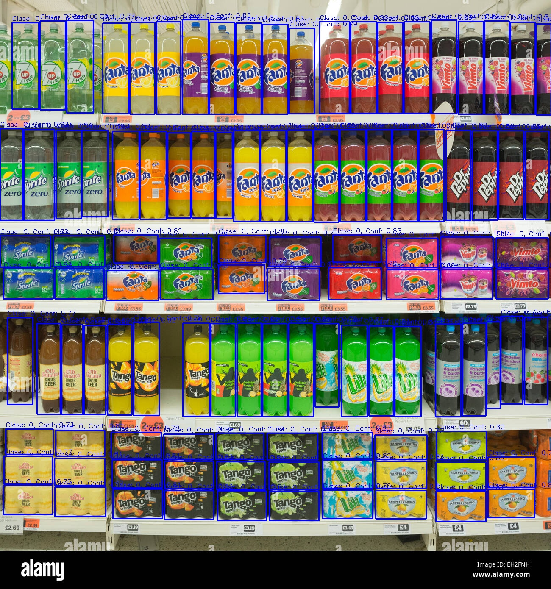

# Detección de SKUs en Imágenes de estantes del sector retail Usando YOLO

Este proyecto implementa un flujo completo para la detección de objetos (SKUs en estanterías) utilizando  YOLOv8. 
El proceso incluye la descarga de un dataset desde Kaggle, la preparación de datos, el entrenamiento del modelo y la realización de predicciones en nuevas imágenes.

## **Estructura del Proyecto**
El notebook está dividido en las siguientes secciones principales:

1. **Características del entorno**: Verifica la disponibilidad de la GPU y el entorno necesario para ejecutar el proyecto.
2. **Descarga del dataset desde Kaggle**: Obtiene los datos necesarios para el entrenamiento del modelo.
3. **Visualización de imágenes y bounding boxes**: Muestra cómo las imágenes del dataset están etiquetadas para el entrenamiento.
4. **Entrenamiento del modelo**: Configura y entrena el modelo YOLO usando el dataset descargado.
5. **Predicción en nuevas imágenes**: Aplica el modelo entrenado a nuevas imágenes y muestra y guarda los resultados.

## **Requisitos**
Para ejecutar este proyecto, se necesita lo siguiente:

- Python 3.8 o superior.
- GPU compatible con CUDA (recomendado para entrenamiento).
- Librerías de Python:
  - `opencv-python`
  - `matplotlib`
  - `numpy`
  - `pandas`
  - `kagglehub`

Puedes instalar estas librerías ejecutando:

```bash
pip install librteria  #-r requirements.txt
```
Además este proyecto descarga datos de Kaggle, por lo que se debe tener configurado correctamente la API de Kaggle, para no tener ningún inconveniente.

## **Resultados**
Aquí hay un ejemplo de detección de productos en una imagen de muestra, tomada de internet.



## **Siguientes Pasos**
El flujo actual del proyecto se enfoca en la detección de objetos (SKUs) y la generación de bounding boxes en imágenes. Estos resultados pueden utilizarse para:

1. **Reconocer el nombre del producto**
   - Implementar un modelo adicional o integrar OCR (Reconocimiento Óptico de Caracteres) para identificar el nombre del producto detectado.
   - Relacionar los nombres de los productos con las bounding boxes obtenidas en el proceso de detección.

2. **Personalización del modelo con imágenes propias**
   - Optimizar el modelo de detección de objetos utilizando un dataset personalizado con imágenes propias de estanterías.

3. **Construcción de un pipeline automatizado**
   - Crear un flujo que permita cargar nuevas imágenes, detectar SKUs y extraer los nombres de los productos de manera automatizada.   